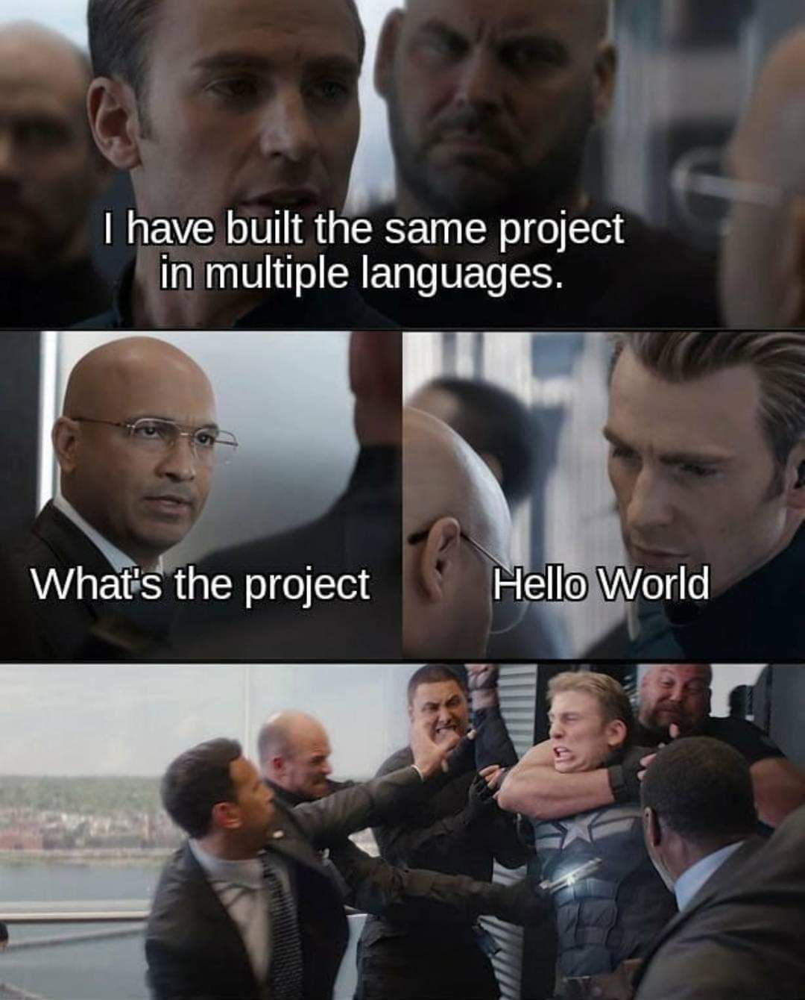
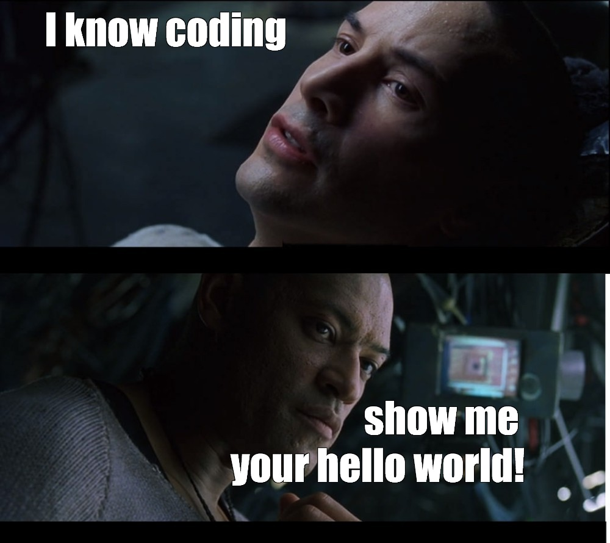

# Hello World in Multiple Languages Extravaganza
Hello world project extravaganza
## Synopsis
This repository contains a collection of "Hello World" programs written in multiple programming languages. This is a fun and educational project that showcases how to print "Hello World" in different programming languages. The goal is to have a "Hello World" program in every programming language. This project is inspired by the [GitHub Hello World](https://docs.github.com/en/get-started/quickstart/hello-world) project. Check out the project website at [https://silviotorre.github.io/helloworld/](https://silviotorre.github.io/helloworld/) for more information.


## check out the code
To get started, clone this repository to your local machine:
```bash
git clone https://github.com/silviotorre/helloworld.git
```
## Getting Started
To run the "Hello World" program in a specific programming language. For example, to run the "Hello World" program in Python, navigate to the project directory and run the program:
```bash
python hello-world.py
```
## tasks
- [x]  create a hello world project
- [ ]  bash hello world
- [ ]  c hello world
- [ ]  c# hello world
- [x]  [cmd line hello world](cmd/README.md)
- [ ]  cobol hello world
- [ ]  f# hello world
- [ ]  fortran hello world
- [ ]  go hello world
- [ ]  groovy hello world
- [x]  [java hello world](java/README.md)
- [ ]  javascript hello world
- [x]  [json hello world](json/README.md)
- [ ]  kotlin hello world
- [x]  [kusto hello world](kusto/README.md)
- [ ]  matlab hello world
- [ ]  node.js hello world
- [ ]  perl hello world
- [ ]  powershell hello world
- [ ]  python hello world
- [ ]  p# hello world
- [ ]  R hello world
- [ ]  ruby hello world
- [ ]  rust hello world
- [ ]  scala hello world
- [ ]  sql hello world
- [ ]  tsql hello world
- [ ]  u-sql hello world
- [ ]  vb hello world
- [ ]  vb.net hello world
- [ ]  xml hello world
- [ ]  yaml hello world


# Extra Credit
- [ ]  Add a new programming languages
- [ ]  Add a project banner
- [ ]  Add a project logo
- [ ]  Add a project translation
- [ ]  Add a project website
- [ ]  Add a project wiki
- [ ]  Add shields to README.md
- [ ]  github actions hello world
- [ ]  google dorks hello world
- [ ]  office macro hello world
- [ ]  uml hello world
- [ ]  unit test hello world

## Contributing
The first documented use of "Hello, World!" as a computer programming message dates back to 1972. It was introduced by [Dennis Ritchie](https://en.wikipedia.org/wiki/Dennis_Ritchie), one of the pioneers of the C programming language, while he was working on the development of the Unix operating system at Bell Labs. The initial version of "Hello, World!" was used in a tutorial for the B programming language, which served as the precursor to C.

"Hello, World!" as a standard introductory example can be attributed to the growth and influence of the C programming language. As C became popular in the 1970s and 1980s, it is simple enough for beginners to understand and illustrates the basic syntax of a programming language. In addition, it is a useful sanity test to make sure that a programming language is correctly installed on a computer.

This is the original code written in C by Dennis Ritchie:
```c
#include <stdio.h>

int main(void){
  printf("hello, world\n");
  return 0;
}
```
So here is the challenge:



If you wont to contribute with your own "Hello World" programs to this repository simply create a new directory with the name of the programming language and add a file named **hello-world** with your implementation.
Don't forget to update the README file to include your contribution!

## Contributors

- Silvio Torre (silviotorre)  - creator, maintainer

## License
- This project is licensed under the MIT License - see the [MIT](https://choosealicense.com/licenses/mit/) file for details

## References
- [GitHub Hello World](https://docs.github.com/en/get-started/quickstart/hello-world)

Enjoy and happy coding!